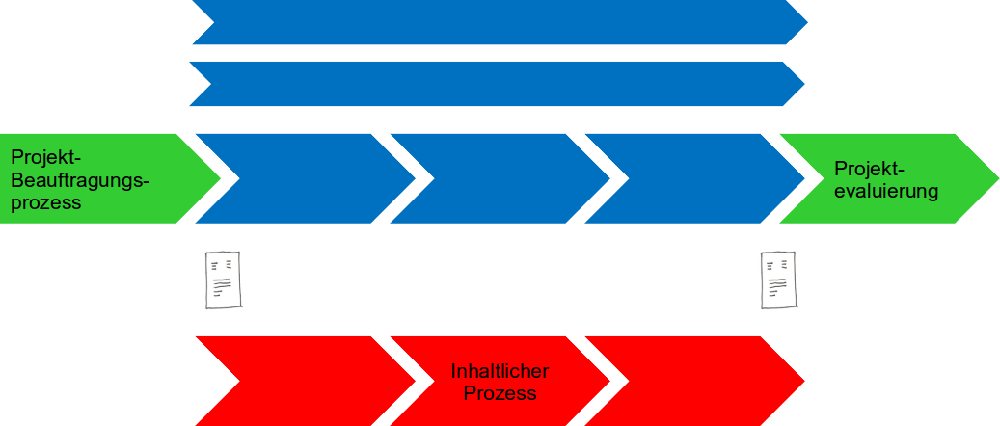

## 1) Projektmanagement-Prozess (PM-Prozess)

Gehen Sie auf folgende **Skizze** ein und erklären Sie die einzelnen **Komponenten des PM-Prozesses**.

*(Bezug auf die dargestellten Elemente wie Projektbeauftragungsprozess, PM-Prozesse, inhaltlicher Prozess und Projektevaluierung)*

---

## 2) Projekt: Neuer Schulzweig „Künstliche Intelligenz“

In der Schule wird ein neuer Zweig **„Künstliche Intelligenz“** eröffnet.

### Projektteam
- **Projektleiter (PL):** Stauss  
- **Projektteammitglieder (PTM):** Riedmann, Kaufmann  
- **Projektmitarbeiter (PM):** Müller, Maier  
- **Projektauftraggeber (PAG):** Hr. Lenz  

### Aufgabenstellung
- Erstellen Sie ein **Organigramm**. Wenn Notwending, nehmen sie noch Mitglieder auf.
- In welchem Diagramm werden die Verantwortlichkeiten für die Arbeitspakete vergeben. Mache eine kleine Skizze wie das aussehen könnte.

---

## 3) Zeitpunkt und Verantwortung der PUA

- Wann würden Sie die **PUA** erstellen?
- Erstellen Sie die PUA **alleine oder im Team**? Begründen Sie Ihre Antwort.
