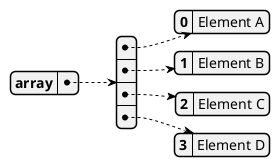
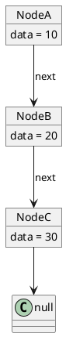
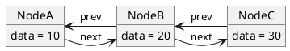
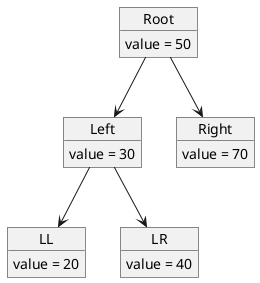
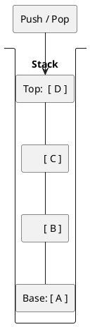
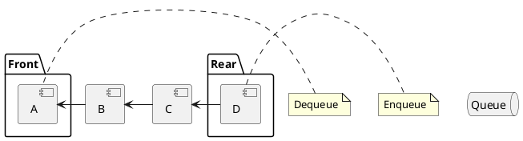

# Data Structures Overview

## 1. Array

A collection of elements identified by index or key.

### Advantages
- **Fast Access**: O(1) time complexity to access elements by index.
- **Memory Efficiency**: Elements are stored in contiguous memory locations (typically).
- **Cache Friendly**: Due to contiguous storage.

### Disadvantages
- **Fixed Size**: In many languages, size must be known at compile time (static arrays). Dynamic arrays mitigate this but have resizing overhead.
- **Slow Insert/Delete**: Inserting or deleting elements in the middle requires shifting subsequent elements (O(n)).

### Diagram

*(Alternatively represented as a contiguous block)*

```plantuml
@startuml
salt
{
  ^Array^
  | [ 0 ] | [ 1 ] | [ 2 ] | [ 3 ] |
  |   A   |   B   |   C   |   D   |
}
@enduml
```

---

## 2. Linked List (Singly)

A linear collection of data elements whose order is not given by their physical placement in memory. Instead, each element points to the next.

### Advantages
- **Dynamic Size**: Easy to add/remove elements without reallocation or resizing overhead.
- **Efficient Insert/Delete**: Insertion and deletion at known positions (e.g., head) is O(1).

### Disadvantages
- **Slow Access**: Accessing an element by index requires traversing the list (O(n)).
- **Memory Overhead**: Extra memory required for storing pointers/references.
- **Not Cache Friendly**: Nodes may be scattered in memory.

### Diagram

---

## 3. Doubly Linked List

Similar to a singly linked list, but each node has a reference to both the next and the previous node.

### Advantages
- **Bidirectional Traversal**: Can traverse forward and backward.
- **Easy Deletion**: Deleting a node is easier if you have a pointer to it, as you have access to the previous node.

### Disadvantages
- **Memory Overhead**: Requires more memory than singly linked lists (two pointers per node).
- **Complexity**: logic for insert/delete is slightly more complex to maintain both pointers.

### Diagram

---

## 4. Tree (General / Binary Tree)

A hierarchical data structure with a root value and subtrees of children with a parent node.

### Advantages
- **Hierarchical Data**: Perfect for representing hierarchies (file systems, HTML DOM).
- **Efficient Search/Sorting**: Binary Search Trees (BST) allow O(log n) search, insert, and delete (if balanced).

### Disadvantages
- **Complexity**: More complex to implement and maintain (balancing algorithms like AVL or Red-Black needed for efficiency).
- **Overhead**: Pointer overhead for children.

### Diagram

---

## 5. Stack

A linear data structure which follows a particular order in which the operations are performed. The order is LIFO (Last In First Out).

### Advantages
- **Simplicity**: Simple methods (push, pop).
- **Function Calls**: Essential for managing function calls and recursion in programming.
- **Memory Management**: Used in stack memory allocation.

### Disadvantages
- **Limited Access**: Can only access the top element. Random access is not allowed/efficient.

### Diagram

*(Conceptually)*

---

## 6. Queue

A linear structure which follows a particular order in which the operations are performed. The order is FIFO (First In First Out).

### Advantages
- **Order Preservation**: Maintains the order of elements as they arrived (e.g., print spooling, task scheduling).
- **Concurrency**: Essential for asynchronous data transfer (message queues).

### Disadvantages
- **Limited Access**: Can generally only access the front (dequeue) and rear (enqueue).

### Diagram

