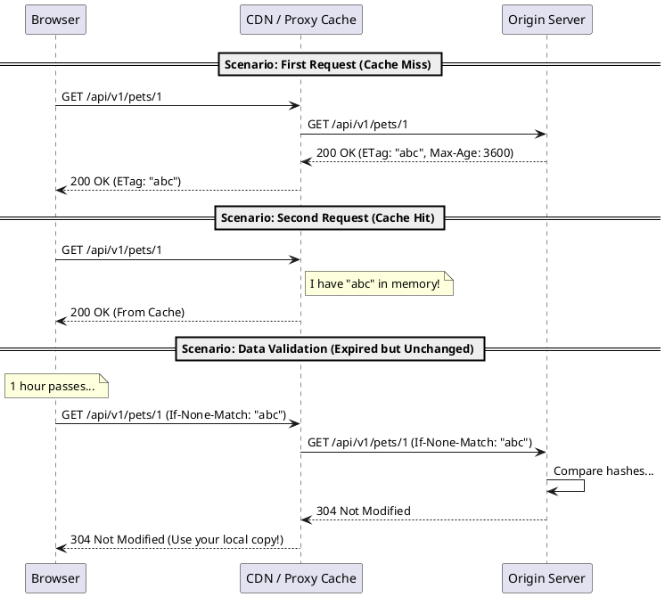

# Caching 

The diagram show how caching works

```plantuml
@startuml
participant Browser
participant "CDN / Proxy Cache" as Cache
participant "Origin Server" as Server

== Scenario: First Request (Cache Miss) ==
Browser -> Cache: GET /api/v1/pets/1
Cache -> Server: GET /api/v1/pets/1
Server --> Cache: 200 OK (ETag: "abc", Max-Age: 3600)
Cache --> Browser: 200 OK (ETag: "abc")

== Scenario: Second Request (Cache Hit) ==
Browser -> Cache: GET /api/v1/pets/1
Note right of Cache: I have "abc" in memory!
Cache --> Browser: 200 OK (From Cache)

== Scenario: Data Validation (Expired but Unchanged) ==
Note over Browser: 1 hour passes...
Browser -> Cache: GET /api/v1/pets/1 (If-None-Match: "abc")
Cache -> Server: GET /api/v1/pets/1 (If-None-Match: "abc")
Server -> Server: Compare hashes...
Server --> Cache: 304 Not Modified
Cache --> Browser: 304 Not Modified (Use your local copy!)
@enduml
```